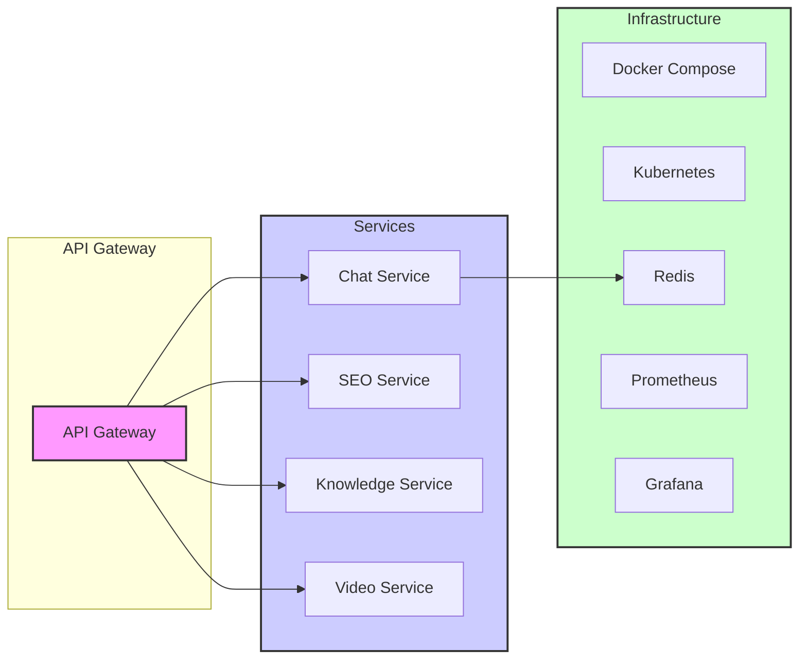

# System Patterns

## System Architecture

Modular microservices architecture.

Each service follows a standard directory structure:

- src/: Contains the application source code (app.py).
- tests/: Contains the test files (test_*.py).
- config/: Contains configuration files (pytest.ini).
- Dockerfile: Docker configuration file.
- requirements.txt: Production dependencies.
- requirements-dev.txt: Development dependencies.

## Key Technical Decisions

- **Microservices:** Break down the application into independent, deployable services for scalability and maintainability.
- **API Gateway:** Use an API gateway to route requests to the appropriate services and handle cross-cutting concerns.
- **Containerization:** Use Docker to containerize each service for consistent deployment across environments.
- **Orchestration:** Use Docker Compose for local development and Kubernetes for production deployment.
- **Caching:** Implement a caching strategy using Redis to improve performance and reduce latency.
- **Monitoring:** Integrate Prometheus and Grafana for monitoring and analytics.
- **CI/CD:** Implemented a CI/CD pipeline using GitHub Actions for automated testing, building, pushing Docker images to container registry, and deploying to Kubernetes.

## CI/CD Pipeline Details

- **CI/CD Workflow:** GitHub Actions workflow defined in `.github/workflows/ci-cd.yml` automates the build, test, and deployment process.
- **Automated Testing:** Includes linting with flake8 and unit testing with pytest, with code coverage reports uploaded to Codecov.
- **Docker Image Build and Push:** Builds Docker images for each service and pushes them to a container registry (e.g., Docker Hub).
- **Kubernetes Deployment:** Deploys services to a Kubernetes cluster, including namespace creation, service and deployment creation for each service.

## Design Patterns

- **Backend for Frontend (BFF):** The API gateway acts as a BFF, tailoring the API for the specific needs of the frontend.
- **Service Registry/Discovery:** Kubernetes service discovery is used to allow services to find and communicate with each other.
- **Circuit Breaker:** Implement circuit breaker pattern in the API gateway to handle service failures gracefully.
- **Load Balancing:** Kubernetes load balancing is used to distribute traffic across multiple instances of each service.

## Component Relationships

- **Chat Service:** Handles chat functionality, built upon the existing Chat WebUI, enhanced with SEO features.
- **SEO Service:** Provides SEO content generation, based on the YouTube SEO Generator script.
- **Knowledge Service:** (Future) Manages knowledge base for enhanced content generation and user support.
- **Video Service:** (Future) Handles video processing and YouTube upload functionalities.
- **API Gateway:** Routes requests to the appropriate services, handles authentication, and potentially rate limiting and other cross-cutting concerns.
- **Redis:** Used for caching in the Chat Service.
- **Prometheus and Grafana:** Used for monitoring and visualizing metrics for all services.
